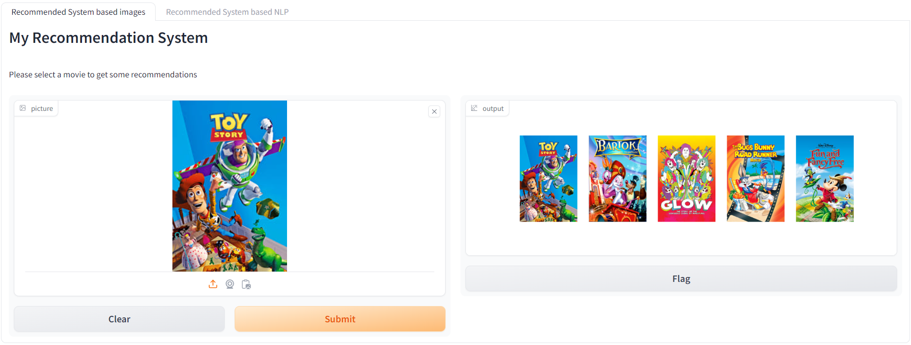
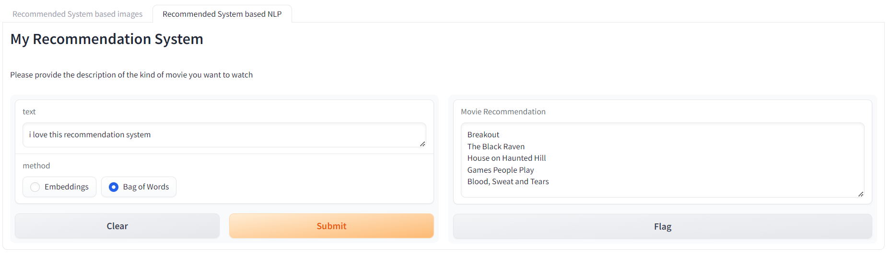

# My Recommendation System

pour pouvoir tester le système de recommendation vous aurez besoin de cloner ce repos ensuite telecharger `Manuellement ` certain fichiers 
présent sur mon drive . voici le lien `https://drive.google.com/drive/folders/1dYvhfCa-vQ400JjUEFu4wiyYywIkB3sb?usp=sharing`
vous placerez le fichier `sample.csv` et le dossier `MLP-20M` dans le dossier `rec_syst1` (le dossier MLP-20M contient un autre dossier nommé MLP-20M ou se trouvent les images)
 le fichier `bag_ofword.ann` quant à lui vous le placerez à la racine de ce dossier  .
une fois que c'est fait . placez vous dans la racine de ce dossier et executez `dokcer-compose up`
une fois que les containeurs sont lancés attendre quelques minutes (5 min) pour l'execution des fichiers qui sont dans les containeurs .
allez ensuite dans votre navigateur et lancez `localhost:7860` vous devrez voir la page d'accueil .
la toute première fois que vous tester le système que ce soit la partie  ` images ` ou la partie `texte ` le système sera un peu lent soyez patient mais après il deviendra rapide .
je vous mets ci dessous un apperçu du rendu final .

